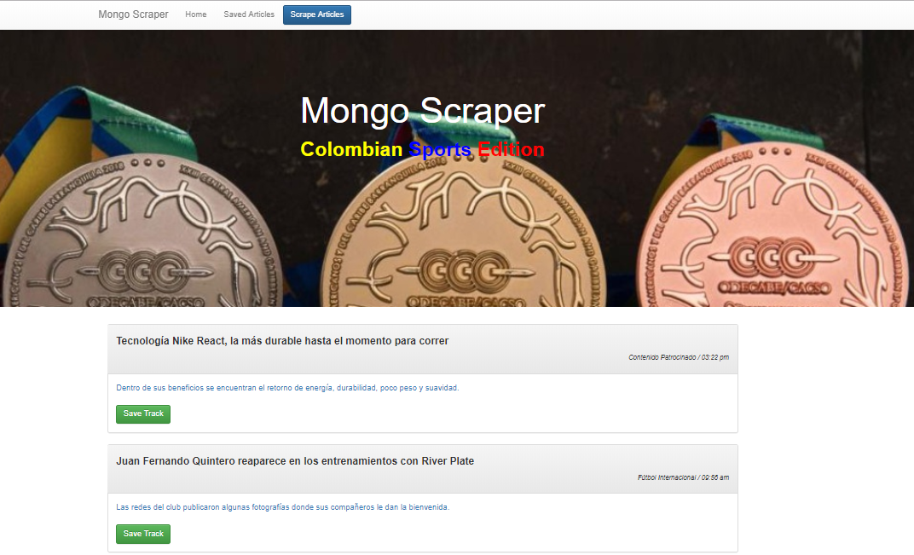

# Mongo Scraper - Colombian Sports Edition

## Description

This is a web app to access the main sports event an results published for the most read news paper in Colombia: **El Tiempo**. 
To start, the user clicks on the button Scrape Articles and the app will scrap the sports section of this online paper and it will retireve the title, the summary, the section and the date of creation of the most recent news. Also, the app will retrieve the link for the user to read the whole article, by clicking on the summary of the article.

Once the articles are retreived, the body of the app will be populated with this articles and the user will have the opportunity of saving his favorite articles. Once he has saved the favorite articles, he can write notes or comments on each of the articles, and also, he will be able to delete the notes form the articles or delete the article from the list of saved articles. Once an article has been saved, it will disappear from the list theat is populated in the home page of the app and will appear on the saved page of the app; and if an article is deleted from the saved page of the app, it will appear on the home page and its notes will be losts.

[Click here to see the deployed app](https://cryptic-stream-84533.herokuapp.com/)

## Technologies used

* Express 
* Express-handlebars 
* Mongoose 
* MongoDB
* Cheerio 
* Axios
* Bootstrap

## Screenshots

## Author

[Fabian Diaz - @fdiaz79](https://fdiaz79.github.io/Portfolio/)